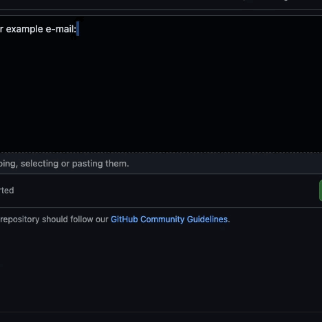

# HandyPaste issue only repository

  

<strong>HandyPaste</strong> is a browser extension to help you with pasting often-use texts. The text could be anything, i.e. e-mails, addresses, cryptocurrency wallet addresses, JSONs, XMLs, URLs, social media URLs, and phone numbers, ...

The extension uses browser API and it synced with your account. Please be noticed that values are not encrypted yet, so texts saved in this extension should not contain sensitive data.

  

